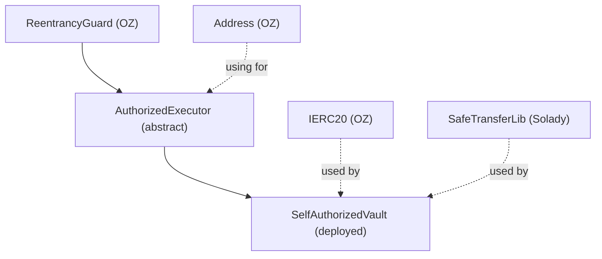
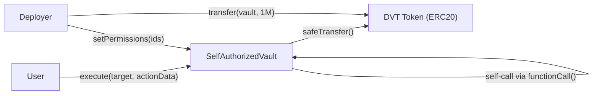
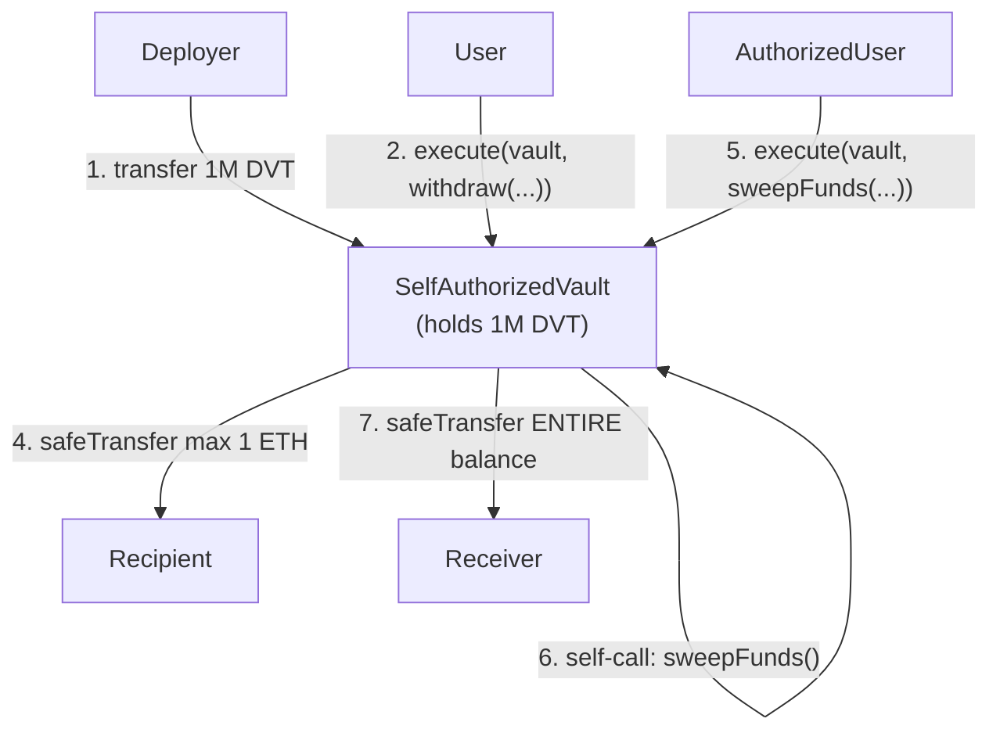
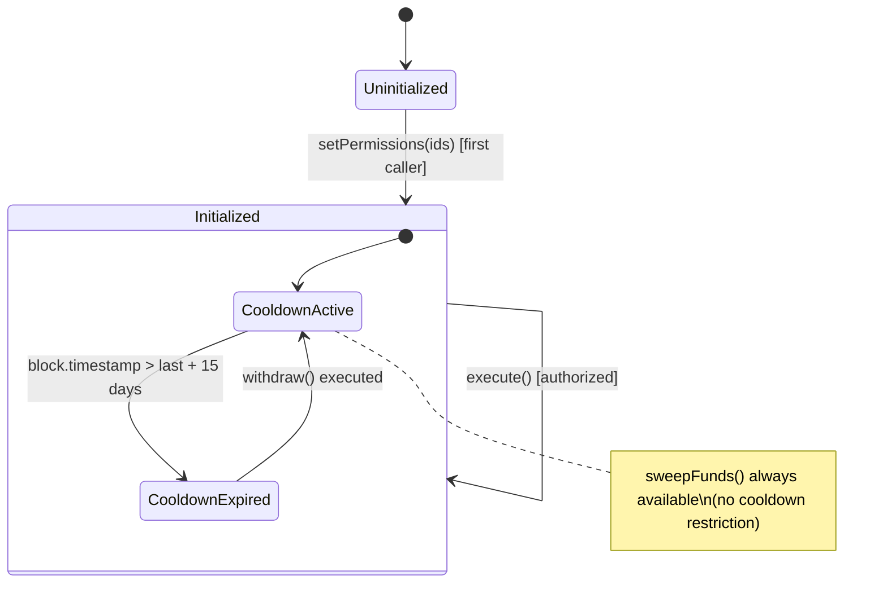

# Architecture — abi-smuggling

## Inheritance Tree

- **Deployed:** `SelfAuthorizedVault` (single contract)
- **Abstract:** `AuthorizedExecutor`
- **Libraries/Interfaces:** `ReentrancyGuard`, `Address`, `IERC20`, `SafeTransferLib`

## Contract Interactions

Key: The vault calls ITSELF via `Address.functionCall()`. This is the only external call pattern — there are no cross-contract interactions beyond ERC20 transfers.

## Token/Value Flow

### Token: DVT (DamnValuableToken)
- **Entry:** Direct `transfer()` from deployer during setup. No deposit function exists.
- **Storage:** Held as ERC20 balance in `SelfAuthorizedVault` contract address.
- **Internal movement:** None. Single contract holds all funds.
- **Exit (limited):** `withdraw()` sends max 1 ETH to recipient, 15-day cooldown.
- **Exit (emergency):** `sweepFunds()` sends ENTIRE balance to receiver, no limits.
- **Fee extraction:** None.

### Fund-Draining Attack Surfaces
1. `withdraw()` — rate-limited, capped at 1 ETH per 15 days (low risk if auth holds)
2. `sweepFunds()` — drains everything in one call (catastrophic if auth is bypassed)
3. Direct `transfer()`/`transferFrom()` on DVT — not callable via vault, requires DVT approval (N/A)

## Protocol State Machine

### State Transition Analysis
- **Stuck states:** If `setPermissions([])` is called with empty array, contract is permanently bricked — initialized with zero permissions, no way to add more. (TAG-006)
- **Unauthorized transitions:** `setPermissions` has no access control — first caller wins. (TAG-004)
- **Invalid combinations:** None — the state model is simple enough that no invalid combinations exist.
- **No pause/emergency/shutdown states:** Once initialized, the contract runs forever with immutable permissions.

## Storage Layout

### SelfAuthorizedVault (inherits AuthorizedExecutor, ReentrancyGuard)

| Slot | Variable | Type | Purpose | Modified By |
|------|----------|------|---------|-------------|
| 0 | `_status` | uint256 | ReentrancyGuard lock state | `execute()` (auto via modifier) |
| 1 | `initialized` | bool | One-time init flag | `setPermissions()` (once) |
| 2 | `permissions` | mapping(bytes32 => bool) | Action ID authorization map | `setPermissions()` (once) |
| 3 | `_lastWithdrawalTimestamp` | uint256 | Timestamp of last withdrawal | `withdraw()` |

### Storage Risk Analysis
- **Slot 0 (`_status`):** Modified by ReentrancyGuard on every `execute()` call. Well-isolated.
- **Slot 1 (`initialized`):** Written once, then read-only forever. No risk.
- **Slot 2 (`permissions`):** Written once during init, then read-only. Keys are `keccak256(selector, caller, target)`. No risk of collision — inputs are fixed-size.
- **Slot 3 (`_lastWithdrawalTimestamp`):** Written by `withdraw()`, read by `withdraw()`. Only `sweepFunds` shares the same entry path but doesn't touch this slot. No cross-function contention risk.

No proxy patterns. No storage collision risks. No shared-state concerns between flows.

## Error/Revert Path Analysis

### execute() Revert Paths
| Step | Revert Condition | State Already Changed | Risk |
|------|-----------------|----------------------|------|
| 1 (nonReentrant) | `_status != 1` (reentering) | None | Safe |
| 2 (permission check) | `!permissions[actionId]` | None | Safe |
| 3 (_beforeFunctionCall) | `target != address(this)` | None | Safe |
| 4 (functionCall) | Target call reverts | None | Safe — OZ Address reverts on failure |

### withdraw() Revert Paths (called via execute → self-call)
| Step | Revert Condition | State Already Changed | Risk |
|------|-----------------|----------------------|------|
| 1 (onlyThis) | `msg.sender != address(this)` | None | Safe |
| 2 (amount check) | `amount > WITHDRAWAL_LIMIT` | None | Safe |
| 3 (time check) | `timestamp <= last + WAITING_PERIOD` | None | Safe |
| 4 (safeTransfer) | Token transfer fails | `_lastWithdrawalTimestamp` updated | LOW — timestamp updated but no tokens moved. Next call must wait another 15 days. |

### sweepFunds() Revert Paths (called via execute → self-call)
| Step | Revert Condition | State Already Changed | Risk |
|------|-----------------|----------------------|------|
| 1 (onlyThis) | `msg.sender != address(this)` | None | Safe |
| 2 (safeTransfer) | Token transfer fails | None | Safe |

## Cross-Flow Interaction Matrix

| Flow A | Flow B | Shared State | Risk |
|--------|--------|-------------|------|
| execute(withdraw) | execute(withdraw) | `_lastWithdrawalTimestamp` | No — nonReentrant prevents concurrent execution |
| execute(withdraw) | execute(sweepFunds) | None directly | No shared state, but sweepFunds drains all tokens making subsequent withdrawals return 0 |
| setPermissions | execute | `initialized`, `permissions` | No — setPermissions must complete before execute can succeed |
| execute(smuggled) | execute(sweepFunds) | Same entry — the smuggled flow IS the sweepFunds flow | **CRITICAL** — TAG-001/002/003 allow executing sweepFunds through execute with withdraw permission |

The cross-flow risk is minimal in a traditional sense because the protocol is single-contract with a simple state model. The real risk is the **intra-flow** divergence within `execute()` itself: the permission check and the actual call operate on different data due to the ABI smuggling vulnerability.
