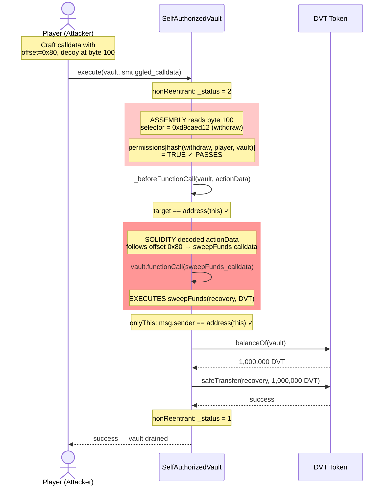

# Flow: execute with Smuggled Calldata (Attack Flow)

## Overview
An attacker (player) crafts non-standard ABI-encoded calldata for `execute()` where the permission check reads an authorized selector (`withdraw`) from byte 100, but Solidity's ABI decoder follows a manipulated offset pointer to the actual `actionData` which contains `sweepFunds` calldata.

## Calldata Layout: Standard vs Smuggled

### Standard ABI Encoding for execute(address, bytes)
```
Byte 0-3:    1cff79cd                         execute() selector
Byte 4-35:   000...target                      address target (word 1)
Byte 36-67:  000...0040                        offset to bytes = 0x40 (word 2)
Byte 68-99:  000...0004                        length of bytes = 4 (word 3)
Byte 100+:   d9caed12 000...                   actionData content (withdraw selector)
```
Permission check reads byte 100 → `d9caed12` (withdraw) ✓
ABI decoder follows offset 0x40 → byte 68 → length → byte 100 → `d9caed12` (withdraw)
**Both match. No smuggling.**

### Smuggled ABI Encoding
```
Byte 0-3:    1cff79cd                         execute() selector
Byte 4-35:   000...target                      address target (word 1)
Byte 36-67:  000...0080                        offset to bytes = 0x80 (word 2) ← MANIPULATED
Byte 68-99:  000...0000                        (padding / unused)
Byte 100-131: d9caed12 000...                  withdraw selector at byte 100 ← DECOY
Byte 132-163: 000...0044                       length of real actionData = 68 bytes
Byte 164-167: 85fb709d                         sweepFunds selector ← REAL PAYLOAD
Byte 168+:    000...receiver 000...token       sweepFunds parameters
```
Permission check reads byte 100 → `d9caed12` (withdraw) ✓ PASSES
ABI decoder follows offset 0x80 → byte 132 → length → byte 164 → `85fb709d` (sweepFunds)
**Divergence! Check says withdraw, execution runs sweepFunds.**

## Sequence Diagram



## Execution Details
1. **Entry:** Raw `call()` to vault with hand-crafted calldata (cannot use `abi.encodeCall` — must be manual)
2. **Validation:**
   - nonReentrant: passes (first call)
   - Permission check: reads `0xd9caed12` from byte 100 → player has this permission → **PASSES** (TAG-001/002)
   - Target check: target is vault → passes
   - onlyThis: self-call → passes
3. **State Reads:** `_status`, `permissions` — both read correctly, but permissions is checked against WRONG selector
4. **External Calls:**
   - `address(this).functionCall(sweepFunds_calldata)` — self-call with SMUGGLED data (TAG-003)
   - `token.balanceOf(address(this))` — returns full vault balance
   - `SafeTransferLib.safeTransfer(token, recovery, fullBalance)` — drains vault
5. **State Writes:** `_status` toggled only (sweepFunds writes no other state)
6. **Token Movements:** DVT: vault → attacker's chosen receiver (ALL 1,000,000 DVT)
7. **Events:** ERC20 Transfer event only

## Revert Paths
| Step | Revert Condition | State Already Changed | Risk |
|------|-----------------|----------------------|------|
| 1 | Reentering | None | N/A |
| 2 | Player doesn't have withdraw permission | None | N/A (they do) |
| 3 | Target != vault | None | N/A (target is vault) |
| 4 | Malformed calldata causes ABI decode error | None | Attacker must craft carefully |
| 5 | Token transfer fails | None | N/A (standard ERC20) |

## Tagged Observations
- [TAG-001] @audit:security — ROOT CAUSE: hardcoded offset reads decoy at byte 100
- [TAG-002] @audit:security — Permission check validates wrong selector
- [TAG-003] @audit:security — functionCall uses Solidity-decoded data (real payload)
- [TAG-009] @audit:knob — Offset pointer (0x80) is attacker-controlled
- [TAG-010] @audit:knob — Decoy bytes at position 100 are attacker-controlled
- [TAG-011] @audit:knob — Player's withdraw permission is the "key" for the smuggle
- [TAG-014] @audit:knob — sweepFunds has no restrictions, maximizing impact

## Notes
This flow is the complete exploit chain. The fix is straightforward: replace the assembly calldata read with `bytes4 selector = bytes4(actionData[:4])`, which always reads from the Solidity-decoded parameter. This eliminates the divergence between what is checked and what is executed.
