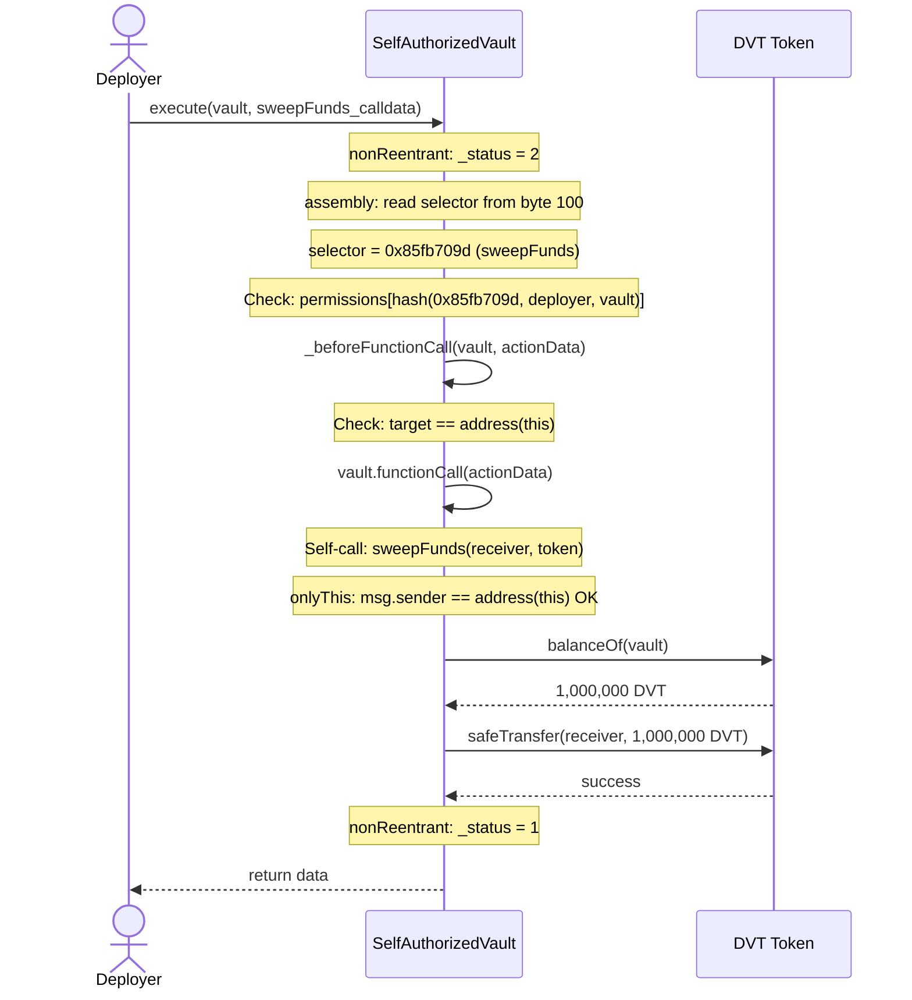

# Flow: execute → sweepFunds (Emergency Sweep)

## Overview
An authorized user (deployer) calls `execute()` to trigger a full emergency drain of all tokens from the vault.

## Sequence Diagram

## Execution Details
1. **Entry:** `execute(address(vault), abi.encodeCall(sweepFunds, (receiver, IERC20(token))))`
2. **Validation:**
   - nonReentrant check
   - Permission check: `permissions[getActionId(0x85fb709d, deployer, vault)]` — only deployer has this
   - Target check: `target == address(this)`
   - onlyThis: `msg.sender == address(this)`
3. **State Reads:** `_status` (slot 0), `permissions` (slot 2), token `balanceOf`
4. **External Calls:**
   - `address(this).functionCall(actionData)` — self-call
   - `token.balanceOf(address(this))` — ERC20 read
   - `SafeTransferLib.safeTransfer(token, receiver, balance)` — ERC20 transfer
5. **State Writes:** `_status` toggled (slot 0) only
6. **Token Movements:** DVT: vault → receiver (ENTIRE balance)
7. **Events:** None emitted by vault (ERC20 Transfer event from token contract)

## Revert Paths
| Step | Revert Condition | State Already Changed | Risk |
|------|-----------------|----------------------|------|
| 1 | Reentering | None | Safe |
| 2 | Permission denied (not deployer) | None | Safe |
| 3 | Target != address(this) | None | Safe |
| 4 | msg.sender != address(this) | None | Safe |
| 5 | Token transfer fails | None | Safe |

## Tagged Observations
- [TAG-014] @audit:knob — No amount limits, no cooldown. Full drain in one call.

## Notes
Only the deployer is authorized for the `sweepFunds` selector. The player does NOT have this permission. However, the ABI smuggling vulnerability (TAG-001/002/003) allows the player to execute this flow while presenting the `withdraw` selector for the permission check.
