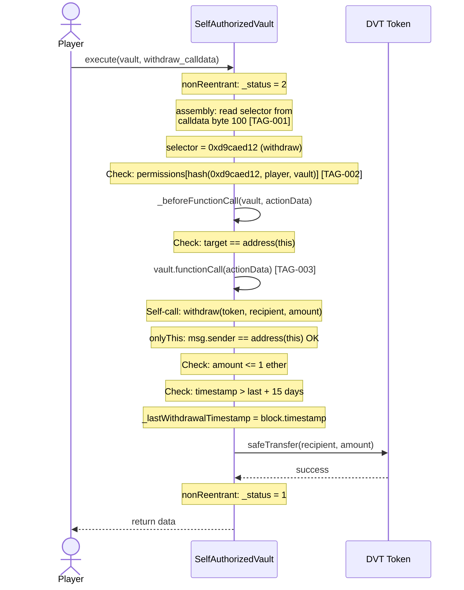

# Flow: execute → withdraw (Legitimate Withdrawal)

## Overview
An authorized user calls `execute()` to trigger a rate-limited token withdrawal from the vault via self-call.

## Sequence Diagram

## Execution Details
1. **Entry:** `execute(address(vault), abi.encodeCall(withdraw, (token, recipient, amount)))`
2. **Validation:**
   - nonReentrant check (slot 0)
   - Permission check: `permissions[getActionId(0xd9caed12, player, vault)]`
   - Target check: `target == address(this)`
   - onlyThis: `msg.sender == address(this)`
   - Amount check: `amount <= WITHDRAWAL_LIMIT`
   - Time check: `block.timestamp > _lastWithdrawalTimestamp + WAITING_PERIOD`
3. **State Reads:** `_status` (slot 0), `permissions` (slot 2), `_lastWithdrawalTimestamp` (slot 3)
4. **External Calls:**
   - `address(this).functionCall(actionData)` — self-call (no reentrancy risk, already guarded)
   - `SafeTransferLib.safeTransfer(token, recipient, amount)` — ERC20 transfer
5. **State Writes:** `_status` toggled (slot 0), `_lastWithdrawalTimestamp` updated (slot 3)
6. **Token Movements:** DVT: vault → recipient (max 1 ETH)
7. **Events:** None emitted by vault functions

## Revert Paths
| Step | Revert Condition | State Already Changed | Risk |
|------|-----------------|----------------------|------|
| 1 | Reentering (status != 1) | None | Safe |
| 2 | Permission denied | None | Safe |
| 3 | Target != address(this) | None | Safe |
| 4 | msg.sender != address(this) | None | Safe |
| 5 | amount > 1 ether | None | Safe |
| 6 | Cooldown not elapsed | None | Safe |
| 7 | Token transfer fails | _lastWithdrawalTimestamp updated | LOW — cooldown reset but no tokens moved |

## Tagged Observations
- [TAG-001] @audit:security at step 2 — Selector read from hardcoded byte 100
- [TAG-002] @audit:security at step 2 — Permission checked against hardcoded selector
- [TAG-003] @audit:security at step 3 — functionCall uses Solidity-decoded actionData
- [TAG-012] @audit:logic at step 4 — onlyThis provides no independent protection
- [TAG-013] @audit:edge at step 6 — Boundary uses strict inequality (<=)

## Notes
This is the HAPPY PATH for a legitimate player withdrawal. All checks pass correctly when standard ABI encoding is used. The vulnerability only manifests when the calldata encoding is manipulated (see `execute-smuggled.md`).
