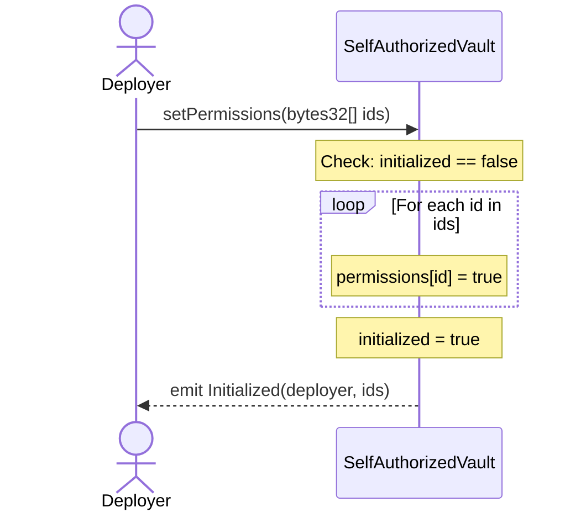

# Flow: setPermissions (Initialization)

## Overview
First caller sets all permission flags for the vault's authorization system. One-time only — permanently locks after execution.

## Sequence Diagram

## Execution Details
1. **Entry:** `AuthorizedExecutor.setPermissions(bytes32[] memory ids)`
2. **Validation:** `initialized == false` (reverts with `AlreadyInitialized` if true)
3. **State Reads:** `initialized` (slot 1)
4. **External Calls:** None
5. **State Writes:** `permissions[id] = true` for each id (slot 2), `initialized = true` (slot 1)
6. **Token Movements:** None
7. **Events:** `Initialized(msg.sender, ids)`

## Revert Paths
| Step | Revert Condition | State Already Changed | Risk |
|------|-----------------|----------------------|------|
| 1 | `initialized == true` | None | Safe |

## Tagged Observations
- [TAG-004] @audit:security at step 1 — No access control; any address can call if first
- [TAG-005] @audit:logic — Permissions are irrevocable after this call
- [TAG-006] @audit:edge — Empty `ids` array still sets `initialized = true`

## Notes
This flow has no reentrancy guard (not needed — no external calls). The critical design flaw is lack of access control, but in the test scenario the deployer calls it before anyone else can.
